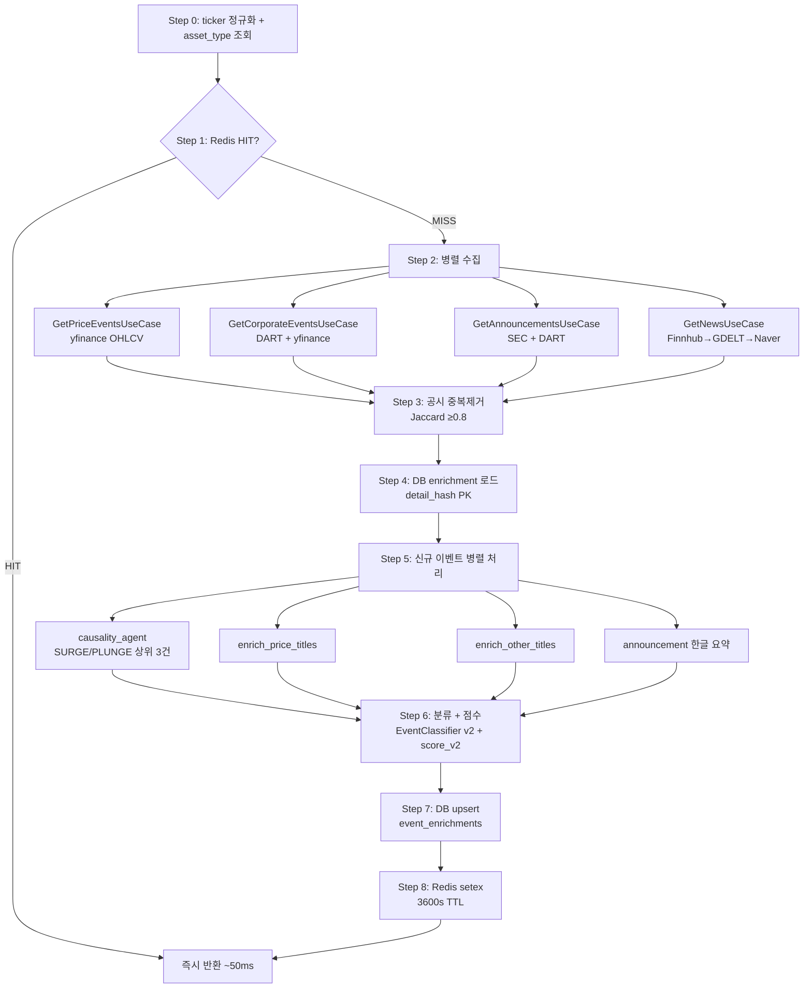
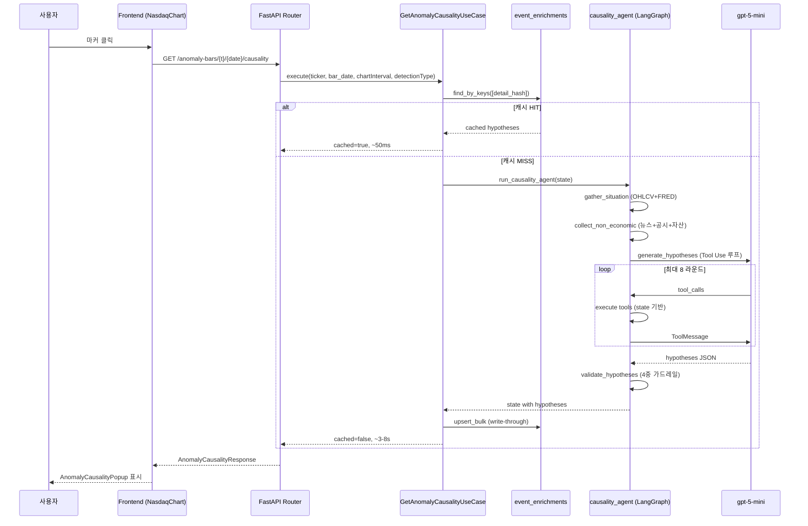

# Antelligen — History Agent · Causality Agent · Dashboard 발표 자료

> **발표일 기준**: 2026-04-28
> **다루는 범위**: `antelligen-backend/app/domains/history_agent`, `antelligen-backend/app/domains/causality_agent`, `antelligen-frontend` 의 `/dashboard` 화면
> **청중 가이드**: 각 섹션은 "**한 줄 요약 → 무엇을/어떻게 → 기술 디테일**" 3단 구조입니다. 비즈니스 청중은 윗부분만 따라가도 흐름이 잡히고, 기술 청중은 디테일까지 깊게 볼 수 있습니다.

---

## 목차

0. [발표 개요](#0-발표-개요)
1. [시스템 아키텍처 한눈에](#1-시스템-아키텍처-한눈에)
2. [History Agent — 타임라인 생성기](#2-history-agent--타임라인-생성기)
3. [Causality Agent — 이상치의 원인을 추론](#3-causality-agent--이상치의-원인을-추론)
4. [Dashboard Frontend — 두 에이전트가 만나는 화면](#4-dashboard-frontend--두-에이전트가-만나는-화면)
5. [신뢰성 / 안정성 장치](#5-신뢰성--안정성-장치-발표-셀링-포인트)
6. [최근 한 달 OKR 성취 (4-22 ~ 4-28)](#6-최근-한-달-okr-성취-4-22--4-28)
7. [성장 전략 (Scale Up)](#7-성장-전략-scale-up)
8. [부록 — 파일 경로·용어 정리](#8-부록--파일-경로용어-정리)

---

## 0. 발표 개요

### 한 줄 요약

> **Antelligen 은 "왜 이 종목이 이 날 이렇게 움직였는가" 를 LLM 으로 추론·시각화하는 투자 정보 플랫폼**입니다. 오늘은 그 핵심을 이루는 **두 개의 에이전트(History · Causality)** 와 그 결과가 만나는 **Dashboard 화면** 을 보여드립니다.

### Antelligen 한 줄 소개

| 항목 | 내용 |
|------|------|
| **무엇인가** | 미국·한국 주식/지수/ETF 의 역사적 가격·이벤트·거시지표를 한 화면에서 보고, 큰 변동의 원인을 LLM 추론으로 설명받는 플랫폼 |
| **레포 구조** | `antelligen-backend` (FastAPI + PostgreSQL + pgvector + Redis) / `antelligen-frontend` (Next.js 16 App Router + Jotai + lightweight-charts) |
| **차별점** | 단순 차트가 아니라, **이상치 봉(anomaly bar) 자동 탐지 → 그 봉의 원인 가설 자동 생성 → 환각 방지 후처리** 까지 자동화 |
| **개발 단계** | 로컬 dev 환경 only (운영 서버 미배포) |

### 오늘 다루는 범위

```
              ┌──────────────────────────────────────────┐
              │             Antelligen 전체              │
              │  (인증 / 검색 / 회사 프로필 / 포트폴리오)│
              └──────────────────────────────────────────┘
                              │
                ┌─────────────┴─────────────┐
                ▼                           ▼
     ┌──────────────────┐        ┌──────────────────┐
     │   본 발표 범위   │        │    그 외 영역    │
     │                  │        │                  │
     │ • History Agent  │        │ • 인증/계정      │
     │ • Causality Agent│        │ • 종목 검색      │
     │ • /dashboard 화면│        │ • 회사 프로필    │
     └──────────────────┘        └──────────────────┘
```

### 발표가 답할 3가지 질문

1. **무엇을 보여주는가** (What) — 사용자는 어떤 화면에서 어떤 정보를 얻는가?
2. **어떻게 만들어지는가** (How) — 그 정보가 만들어지는 데이터 파이프라인은 어떻게 흐르는가?
3. **어떻게 신뢰할 수 있는가** (Why trust) — LLM 의 환각·캐시 정합성·장애 대응을 어떻게 다루는가?

---

## 1. 시스템 아키텍처 한눈에

### 한 줄 요약

> **외부 데이터 소스 8종 → 두 에이전트가 비동기 병렬 처리 → Postgres/Redis 이중 캐시 → FastAPI SSE → Next.js Jotai 상태 → 사용자 화면.** 한 종목 타임라인 생성에 평균 4초, 캐시 히트 시 50ms.

### 무엇을 / 어떻게

전체 데이터 흐름을 한 장으로:

```
                    ┌─────────────────────────────────────────────────┐
                    │        외부 데이터 소스 (8종)                   │
                    │                                                 │
   ┌─ 미국 ────────┤  yfinance  · SEC EDGAR  · Finnhub  · GDELT     │
   │               │  FRED      · GPR Index  · 연관자산(VIX/Oil/UST)│
   │               │                                                 │
   └─ 한국 ────────┤  DART      · Naver 뉴스                        │
                    └─────────────────────────────────────────────────┘
                                          │
                                          ▼
                    ┌─────────────────────────────────────────────────┐
                    │           antelligen-backend (FastAPI)          │
                    │                                                 │
                    │   ┌──────────────────┐    ┌──────────────────┐  │
                    │   │  History Agent   │◄──►│ Causality Agent  │  │
                    │   │  (타임라인 생성) │    │ (이상치 원인추론)│  │
                    │   └──────────────────┘    └──────────────────┘  │
                    │            │                       │            │
                    │            └───────┬───────────────┘            │
                    │                    ▼                            │
                    │   ┌────────────────────────────────────┐        │
                    │   │   캐시 레이어 (이중화)             │        │
                    │   │   • Redis  : 응답 단위 1h TTL      │        │
                    │   │   • Postgres: event_enrichments    │        │
                    │   │     (영구, detail_hash PK)         │        │
                    │   └────────────────────────────────────┘        │
                    └─────────────────────────────────────────────────┘
                                          │ SSE (progress/done/error)
                                          ▼
                    ┌─────────────────────────────────────────────────┐
                    │        antelligen-frontend (Next.js 16)         │
                    │                                                 │
                    │   ┌──────────────────────────────────────────┐  │
                    │   │   /dashboard (2열 4:1 그리드)            │  │
                    │   │                                          │  │
                    │   │   좌상: NasdaqChart + 마커 6종           │  │
                    │   │   좌하: HistoryPanel (타임라인 카드)     │  │
                    │   │   우상: StockSearch                       │  │
                    │   │   우하: AssetProfilePanel                 │  │
                    │   └──────────────────────────────────────────┘  │
                    │                                                 │
                    │   상태: Jotai atoms (localStorage 영속)         │
                    └─────────────────────────────────────────────────┘
                                          │
                                          ▼
                                       사용자
```

### 기술 디테일 — 핵심 스택

| 레이어 | 기술 | 역할 |
|--------|------|------|
| **백엔드 프레임워크** | FastAPI (async) | REST API + SSE 스트리밍 |
| **LLM 오케스트레이션** | LangGraph (StateGraph) | causality_agent 4 노드 워크플로우 |
| **LLM 호출** | LangChain Tool Use | `bind_tools()` 로 8개 도구 자동 호출 루프 |
| **모델** | gpt-5-mini (causality), gpt-4-mini (title/macro) | 비용·정확도 균형 |
| **DB** | PostgreSQL + pgvector | event_enrichments 영구 캐시 (detail_hash PK) |
| **캐시** | Redis (asyncio) | 응답 단위 1h TTL, 분산 락 |
| **프론트엔드 프레임워크** | Next.js 16 (App Router) | RSC + Client Component 혼합 |
| **상태 관리** | Jotai 2.19 | 원자 기반 + atomWithStorage 영속화 |
| **차트** | lightweight-charts 5.1 | Candlestick + 마커 |
| **보조 차트** | Recharts 3.8 | 경제 일정 등 |
| **스타일링** | Tailwind CSS 4 | utility-first |

### 두 에이전트의 호출 시점 차이

```
사용자 종목 입력 ─┐
                 ▼
      [History Agent 즉시 호출]   ◄── 페이지 로드 시 자동
                 │
                 ▼
        타임라인 + 이상치 봉 표시
                 │
                 │ (사용자가 차트 마커 클릭할 때)
                 ▼
      [Causality Agent lazy 호출]  ◄── 마커 클릭 trigger
                 │
                 ▼
        AnomalyCausalityPopup 표시
```

**핵심**: causality_agent 는 LLM Tool Use 가 비싸므로 **lazy fetch + DB 캐시 write-through** 로 한 번 추론한 가설은 영구 보관합니다.

---

## 2. History Agent — 타임라인 생성기

### 한 줄 요약

> **종목 코드 하나만 받으면, 8개 외부 소스에서 가격·기업 이벤트·공시·거시지표·뉴스를 모아 '시점이 명확한 사건'만 골라 한 줄 타임라인으로 만들어주는 오케스트레이션 에이전트**입니다. EQUITY/INDEX/ETF 자산 유형마다 파이프라인이 다릅니다.

### 무엇을 / 어떻게

#### 사용자 관점

사용자는 종목 코드(예: `AAPL`, `005930`, `^GSPC`, `SPY`)와 봉 단위(1D/1W/1M/1Q)만 입력합니다. 그러면:

1. **차트** 옆에 **세로 타임라인** 이 뜨고
2. 각 카드에 "**언제 / 무슨 카테고리 / 어떤 사건 / AI 가 요약한 한 줄 제목 / 이후 5일·20일 초과수익률**" 이 표시됩니다
3. 카드를 클릭하면 차트의 해당 봉이 하이라이트됩니다

#### 지원 자산 타입과 파이프라인 차이

| 자산 타입 | 어떻게 식별 | 파이프라인 |
|-----------|-------------|-----------|
| **EQUITY** (개별 종목) | yfinance `quote_type=EQUITY` | 기업 이벤트(실적·배당) + 공시(SEC/DART) + 뉴스 + 매크로 컨텍스트 |
| **INDEX** (지수) | `quote_type=INDEX` (예: ^GSPC, ^KS11) | 지수별 맞춤 매크로 이벤트 + 인과 규칙 기반(±3일 매핑) |
| **ETF** | `quote_type=ETF` (예: SPY, QQQ) | 자산 클래스 매크로 + 상위 5개 보유 종목 이벤트 분해 |
| **그 외** | 알 수 없음 | 빈 응답 + WARNING 로그 (T1-4 안전 가드) |

### 2.1. 입출력 스키마

#### 주요 엔드포인트 (`/api/v1/history-agent`)

| 메서드 | 경로 | 목적 | 응답 방식 |
|--------|------|------|-----------|
| `GET` | `/timeline` | 종목 타임라인 일괄 조회 | JSON 단발 |
| `GET` | `/timeline/stream` | 같은 데이터, SSE 스트리밍 | text/event-stream |
| `GET` | `/macro-timeline` | 큐레이션된 역사적 매크로 사건 | JSON, 24h 캐시 |
| `GET` | `/macro-timeline/stream` | 위와 동일, SSE | text/event-stream |
| `GET` | `/anomaly-bars` | 차트의 이상치 봉 목록 | JSON |
| `GET` | `/anomaly-bars/{ticker}/{bar_date}/causality` | 특정 이상치 봉의 원인 가설 (lazy) | JSON |
| `POST` | `/titles` | 배치 타이틀 생성 | JSON |
| `GET` | `/admin/fred/health` | FRED 시리즈 헬스 체크 | JSON |

#### Request 예시

```http
GET /api/v1/history-agent/timeline?ticker=AAPL&chartInterval=1M&enrichTitles=true
```

- `ticker` (str): 종목 코드. 한국 종목은 자동 corp_code 매핑
- `chartInterval` (str): `1D` | `1W` | `1M` | `1Q` — **봉 단위**(조회 윈도우 아님)
- `enrichTitles` (bool, default=True): LLM 타이틀 생성 여부

> **네이밍 주의**: `period` 라는 이름이 백엔드에 잔존하지만 의미는 "**chartInterval (봉 단위)**" 입니다. `/macro-timeline` 만 예외적으로 lookbackRange (조회 기간) 의미로 씁니다. 정정안은 follow-up 으로 트래킹 중.

#### Response 스키마 — `TimelineResponse` (v8 캐시 버전)

```json
{
  "ticker": "AAPL",
  "chart_interval": "1M",
  "count": 42,
  "asset_type": "EQUITY",
  "is_etf": false,
  "region": null,
  "events": [
    {
      "title": "AI 칩 수요 우려에 9월 CPI 서프라이즈가 겹쳐 8.2% 급락",
      "date": "2024-09-18",
      "category": "MACRO",
      "type": "CPI",
      "detail": "9월 CPI 8.2% YoY (예상 7.8%) ...",
      "source": "FRED:CPIAUCSL",
      "url": "https://fred.stlouisfed.org/series/CPIAUCSL",
      "change_pct": 0.4,
      "macro_type": "TYPE_A",
      "reason": null,
      "reason_confidence": null,
      "importance_score": 0.85,
      "abnormal_return_5d": -3.21,
      "abnormal_return_20d": -5.4,
      "causality": [
        {
          "hypothesis": "...",
          "supporting_tools_called": ["get_fred_series", "fetch_news_headlines"]
        }
      ],
      "constituent_ticker": null,
      "weight_pct": null
    }
  ]
}
```

**필드 의미** (혼합 청중용):

- `category` — 이벤트의 큰 분류. **CORPORATE**(기업 행사), **ANNOUNCEMENT**(공시), **MACRO**(거시), **NEWS**(뉴스)
- `type` — 세부 유형. CPI / EARNINGS / DIVIDEND / MERGER_ACQUISITION / VIX_SPIKE 등
- `macro_type` — MACRO 한정. **TYPE_A** = 발표(FOMC, CPI 등) · **TYPE_B** = 시장 반응(VIX 급등 등)
- `reason_confidence` — TYPE_B 매크로의 추정 사유 신뢰도. **HIGH/MEDIUM/LOW**
- `importance_score` — 0~1 척도, LLM 랭커가 매긴 중요도
- `abnormal_return_5d/20d` — **AR (Abnormal Return)**. 시장 평균 대비 초과수익률 (%)
- `causality` — 해당 이벤트의 원인 가설 배열 (causality_agent 결과 캐시)
- `constituent_ticker` — ETF 분해 시 보유 종목 (예: SPY 의 NVDA)

### 2.2. 8단계 메인 파이프라인 — `HistoryAgentUseCase.execute()`

(파일: `app/domains/history_agent/application/usecase/history_agent_usecase.py:624-798`)



#### 단계별 디테일

| Step | 무엇을 하는가 | 핵심 코드 |
|------|---------------|-----------|
| **0** | ticker 정규화, 한국 종목 corp_code 자동 조회, 캐시 키 빌드 | `_resolve_ticker()` |
| **1** | `Redis GET history_agent:v8:{asset_type}:{ticker}:{period}` | 1h TTL |
| **2** | 4개 UseCase 동시 실행 (`asyncio.gather`) | T1-2 병렬화 |
| **3** | 같은 사건이 여러 소스에서 들어왔을 때 (DART vs SEC vs Yahoo) Jaccard 0.8 이상 쌍 식별, source 우선순위로 1건만 채택 | `_dedupe_announcements()` (T2-7) |
| **4** | `(ticker, date, type, detail_hash)` 4중 키로 DB 에서 기존 enrichment 로드 → title/causality 즉시 주입 | event_enrichments PK |
| **5** | 신규 이벤트만 병렬로 enrichment. causality_agent 는 비싸므로 SURGE/PLUNGE 상위 3건만 호출 | `_enrich_causality()` |
| **6** | EventClassifier v2 가 MAJOR_EVENT 만 LLM 으로 12개 후보 type 중 재분류, ImportanceService 가 1~5 점수 부여 | `event_classifier_service.py` |
| **7** | `upsert_bulk` (ON CONFLICT DO UPDATE) | `event_enrichment_repository_impl.py` |
| **8** | `setex(cache_key, 3600s, response.model_dump_json())` | Redis |

### 2.3. 데이터 소스 8종

| 소스 | 무엇을 가져오는가 | 한국/미국 | 특이사항 |
|------|-------------------|-----------|---------|
| **yfinance** | OHLCV, 기업이벤트(배당·분할), ETF holdings | 양쪽 | 429 보호 backoff 래퍼 |
| **DART** | 한국 공시 (실적·구조조정·임원변동·신주발행 등) | 한국 | corp_code lazy load + Redis 캐시 |
| **SEC EDGAR** | 미국 8-K (5건 Item 코드 필터) | 미국 | 영문 → 한글 요약 LLM |
| **FRED** | 거시지표 (Fed Funds, CPI, 실업률 등) | 미국 | 12개 시리즈, 4-tuple 설정 (T1-1) |
| **Finnhub** | 뉴스 + 애널리스트 레이팅 + 실적 서프라이즈 | 미국 | buy% ±10%p / surprise ≥2% → 이벤트 |
| **GDELT** | 글로벌 뉴스 (자연어 검색) | 양쪽 | 지수 종목용 fallback |
| **Naver 뉴스** | 한국 뉴스 | 한국 | causality_agent 한국 종목 분기 |
| **GPR Index** | 지정학 리스크 (월간) | 글로벌 | MoM 상승 20%p 이상 → MACRO |
| **연관자산** | VIX, WTI 원유, 금, US 10Y, FX | 글로벌 | 일간 |Δ| ≥ 2% → MACRO TYPE_B |

### 2.4. 이벤트 분류 체계

#### 카테고리 × Type 매트릭스

| Category | Types (대표) | 탐지 방법 |
|----------|--------------|-----------|
| **CORPORATE** | EARNINGS, DIVIDEND, STOCK_SPLIT, RIGHTS_OFFERING, BUYBACK, MANAGEMENT_CHANGE, DISCLOSURE | yfinance 코드 매칭 (규칙) |
| **ANNOUNCEMENT** | MERGER_ACQUISITION, CONTRACT, MAJOR_EVENT, EARNINGS_RELEASE, DEBT_ISSUANCE 외 12종 | SEC Item 코드 + 본문 LLM 재분류 (v2) |
| **MACRO** | INTEREST_RATE, CPI, UNEMPLOYMENT, VIX_SPIKE, OIL_SPIKE, GEOPOLITICAL_RISK | FRED 시리즈 + 연관자산 threshold |
| **NEWS** | (단일 유형) | source 필드로 provider 구분 |

#### MACRO TYPE_A vs TYPE_B 의 의미

| 분류 | 정의 | 예시 | reason 필드 |
|------|------|------|-------------|
| **TYPE_A** | **원인 / 발표 자체** | FOMC 금리 결정, CPI 발표, 실업률 발표 | 없음 (사실 자체가 사유) |
| **TYPE_B** | **결과 / 시장 반응** | VIX 급등, 유가 급변, 환율 변동 | **추정 사유 + 신뢰도** (KR2) |

> **핵심**: TYPE_B 만 "왜 그랬는지" 추정이 필요하므로 `reason` + `reason_confidence` 가 채워집니다. TYPE_A 는 그 자체가 원인.

### 2.5. 다층 이상치 탐지 (OKR 3, KR1~5)

#### 한 줄 요약

> **단일봉 z-score 만으로는 놓치는 패턴(드로다운 구간, 변동성 클러스터링 등)을 5중 탐지기로 보강**해 차트에 6종 마커로 표시합니다.

#### 5중 탐지기 — `detect_anomaly_bars_usecase.py`

| 탐지기 | 트리거 조건 | 마커 |
|--------|-------------|------|
| **1. z-score** | `\|return\| > max(K×σ + floor, 절대 floor)`<br>K=2.5, floor: 1D=5~7%(종목군), 1W=3%, 1M=5%, 1Q=10% | ★ 노랑 |
| **2. cumulative 5d** | 5일 누적 수익률 \|±10%\| 진입 | 🔻 오렌지 |
| **3. cumulative 20d** | 20일 누적 수익률 \|±15%\| 진입 | 📉 진홍 |
| **4. drawdown** | 60봉 고점 대비 -10% 도달(start) → -3% 회복(recovery) | 🔽 보라 / 🔼 에메랄드 |
| **5. volatility cluster** | 5거래일 내 \|r\|>5% 큰 변동 2건 이상 묶음 | ⚡ 앰버 |

#### Robust σ (KR4)

`settings.anomaly_robust_sigma_method` 로 표준편차 추정 방식을 선택할 수 있습니다:

- `"stdev"` (default) — 일반 표준편차
- `"stable"` — `|r|<3%` 구간만 사용 (큰 변동 제외, 실제 노이즈 σ 추정)
- `"mad"` — Median Absolute Deviation × 1.4826 (이상치에 robust)

#### 응답 스키마 — `AnomalyBarsResponse`

```json
{
  "anomaly_bars": [
    {
      "date": "2024-09-18",
      "open": 150.5, "high": 155.2, "low": 149.8, "close": 154.3,
      "change_pct": 3.21,
      "volume_ratio": 2.45,
      "time_of_day": "INTRADAY",
      "detection_types": ["zscore", "cumulative_5d"],
      "return_5d": 2.15,
      "return_20d": 5.32
    }
  ],
  "count": 28
}
```

`detection_types` 가 배열인 이유: **하나의 봉이 여러 탐지기에 동시 hit 될 수 있기 때문**. 이 경우 차트에 마커가 겹쳐 표시되지 않도록 프론트에서 우선순위로 1개만 그립니다.

### 2.6. 매크로 인과관계 — `macro_reason_service.py` (KR2 5단계 fallback)

TYPE_B 매크로 이벤트(VIX 급등 등)에 대해 **"왜 그랬는가"** 를 추정하는 5단계:

```
Step 1: 같은 날 TYPE_A cross-ref
        └─ 예: VIX 급등 당일 FOMC → confidence=HIGH, evidence=URL

Step 2: ±7일 TYPE_A cross-ref
        └─ confidence=MEDIUM, evidence="발표명 N일 전/후"

Step 3: GDELT 뉴스 검색 (키워드 매칭)
        └─ 키워드 맵: VIX_SPIKE→"stock volatility", OIL_SPIKE→"crude oil"
        └─ confidence=MEDIUM, evidence=뉴스 제목
        └─ 캐시 7일 TTL (뉴스 쇠도 빠름)

Step 4: LLM 추정 (안전장치 포함)
        ├─ KR3 cutoff 체크: 이벤트 날짜 > history_macro_reason_cutoff → skip
        ├─ 프롬프트: "근거 없으면 '원인 미확인' 답변. 추측 금지."
        └─ JSON 응답 강제: {"reason": ..., "evidence": ...}
            → evidence 없으면 reason도 "원인 미확인"

Step 5: 최종 fallback
        └─ reason=None (미해결)
```

#### 캐시

- LLM 결과: 90일 TTL
- 뉴스 검색: 7일 TTL
- Redis 키: `macro_reason:{version}:{sha256[:16]}`

#### 안전장치 — `history_macro_reason_cutoff`

`settings.history_macro_reason_cutoff = "2024-01-01"` 같은 cutoff 일자를 두어 **신뢰할 수 있는 LLM 학습 데이터 범위 안에서만 추론**합니다. 그 이후 사건은 LLM 호출 자체를 skip 해서 환각을 원천 차단.

### 2.7. 캐시 전략

#### L1 Redis — 응답 단위

```
Key:   history_agent:v8:{asset_type}:{ticker}:{period}[:no-titles]
Value: TimelineResponse JSON
TTL:   3600s (1h)
```

**버전 변천사**:
- v1→v2: `asset_type` 필드 추가 (stale 방지)
- v2→v3: NEWS 카테고리 추가
- v3→v8: `macro_type` / `reason` / `reason_confidence` / AR 필드 추가

**버전 bump 의미**: 캐시 키에 버전이 포함되므로, 버전이 오르면 기존 캐시를 자동 무효화. 다운타임 없이 스키마 진화 가능.

#### L2 PostgreSQL — 이벤트 단위

```sql
-- event_enrichments 테이블
PRIMARY KEY (ticker, event_date, event_type, detail_hash)
detail_hash = SHA256(
    f"{constituent_ticker}|{detail}" if constituent
    else detail
)[:16]

-- 칼럼
title           TEXT       -- LLM 생성 타이틀
causality       JSONB      -- 가설 배열
importance_score REAL      -- 0..1
classifier_version TEXT    -- v2 등
updated_at      TIMESTAMPTZ
```

**왜 detail_hash 가 PK 일부인가?** ETF 분해 시 같은 날짜·타입이라도 보유 종목이 다르면 다른 이벤트로 취급해야 함. constituent_ticker 를 hash 에 포함해 충돌 방지.

#### 분산 락 — macro-timeline 갱신

```
Key:   lock:{cache_key}
TTL:   60s
Poll:  1s × 30회 = 30s timeout
Graceful: 락 timeout 시 락 없이 계산 진행 (사용자 영향 최소화)
```

같은 region·period 의 macro-timeline 을 여러 사용자가 동시에 트리거해도 **한 번만 LLM 호출**하도록 보장.

---

## 3. Causality Agent — 이상치의 원인을 추론

### 한 줄 요약

> **차트에서 이상치 봉(빨간 ★ 등)을 클릭하면, LLM 이 8개 도구를 자율적으로 호출하며 "왜 이 날 이렇게 움직였는가" 를 3~6개 가설로 답합니다. 4중 환각 방지 가드레일을 거친 결과만 표시됩니다.**

### 무엇을 / 어떻게

#### 사용자 관점

차트에서 이상치 마커 클릭 → **AnomalyCausalityPopup** 모달 등장 → 다음 정보 표시:

1. **요약 그리드**: 방향(상승/하락) · 수익률 · 거래량 배수
2. **가설 카드 3~6개**:
   - 신뢰도 색상 (HIGH=초록, MEDIUM=황, LOW=회색+⚠)
   - 레이어 태그 (DIRECT/SUPPORTING/MARKET)
   - 가설 본문 + 근거 + 출처 링크
   - 사용된 도구 배지
3. **이후 전개**: +1/5/20봉 누적 수익률
4. **유사 과거 사건 Top 3**

#### 호출 흐름



### 3.1. LangGraph 4 노드 워크플로우

(파일: `app/domains/causality_agent/application/causality_agent_workflow.py:47-106`)

```
┌──────────────────────────────────────────────────────────────┐
│                      CausalityAgentState                      │
│  ticker, start_date, end_date, detection_type, anomaly_meta  │
│  ohlcv, fred_series, news, announcements, related_assets...  │
│  hypotheses, validation_notes                                 │
└──────────────────────────────────────────────────────────────┘
                              │
                              ▼
        ┌─────────────────────────────────────────┐
        │  Node 1: gather_situation               │
        │  ─ yfinance OHLCV (또는 cached_daily_bar)│
        │  ─ FRED 경제지표 (FEDFUNDS, CPIAUCSL,...) │
        │  ─ asyncio.gather 병렬 수집              │
        └─────────────────────────────────────────┘
                              │
                              ▼
        ┌─────────────────────────────────────────┐
        │  Node 2: collect_non_economic           │
        │  ─ 뉴스: Finnhub/GDELT/Naver (region별)  │
        │  ─ 공시: SEC EDGAR 8-K / DART            │
        │  ─ 연관자산: VIX/원유/금/UST10Y/FX        │
        │  ─ GPR Index, Finnhub 분석가 추천         │
        └─────────────────────────────────────────┘
                              │
                              ▼
        ┌─────────────────────────────────────────┐
        │  Node 3: generate_hypotheses             │
        │  ─ LangChain Tool Use 루프 (최대 8 라운드)│
        │  ─ gpt-5-mini.bind_tools(8 tools)        │
        │  ─ 도구 호출 → result → ToolMessage 반복  │
        │  ─ 도구 비호출 시 JSON 가설 파싱          │
        └─────────────────────────────────────────┘
                              │
                              ▼
        ┌─────────────────────────────────────────┐
        │  Node 4: validate_hypotheses             │
        │  ─ KR3 4중 가드레일 정규식 후처리         │
        │  ─ 단정/추천/단순화/인과혼동 검출        │
        │  ─ confidence 강등 또는 가설 삭제        │
        └─────────────────────────────────────────┘
                              │
                              ▼
                     state.hypotheses
```

### 3.2. LLM Tool Use 루프 — `generate_hypotheses_node.py`

```python
async def generate_hypotheses(state: CausalityAgentState) -> Dict[str, Any]:
    tools = make_langchain_tools(state)  # 8개 도구 바인딩
    llm = get_workflow_llm(model="gpt-5-mini").bind_tools(tools)

    messages = [
        SystemMessage(content=build_hypotheses_system_prompt(
            detection_type=state["detection_type"],
            anomaly_meta=state["anomaly_meta"],
        )),
        HumanMessage(content=build_user_payload(state)),
    ]

    for round_idx in range(_MAX_TOOL_ROUNDS):  # 최대 8 라운드
        response = await llm.ainvoke(messages)
        messages.append(response)

        if not response.tool_calls:
            # 도구 비호출 → 최종 답변. JSON 파싱
            return {"hypotheses": _parse_hypotheses_json(response.content)}

        # 도구 호출 결과를 ToolMessage 로 추가
        for tool_call in response.tool_calls:
            result = await execute_tool(tool_call, state)
            messages.append(ToolMessage(
                content=json.dumps(result),
                tool_call_id=tool_call["id"],
            ))
```

#### 8개 도구 (`causality_tools.py:18-162`)

| 도구 | 무엇을 반환하는가 |
|------|-------------------|
| `get_ohlcv_window` | 지정 구간 OHLCV (state 캐시에서 조회) |
| `get_fred_series` | FRED 경제지표 시계열 |
| `fetch_news_headlines` | Finnhub/GDELT/Naver 뉴스 헤드라인 |
| `fetch_announcements` | SEC 8-K / DART 공시 목록 |
| `get_market_comparison` | 벤치마크(^GSPC, ^KS11) 대비 상대 수익률 |
| `get_sector_comparison` | SPDR 섹터 ETF 대비 (US 만) |
| `get_related_assets` | VIX/원유/금/UST10Y/FX 변동 |
| `get_analyst_ratings` | Finnhub 분석가 buy/hold/sell 트렌드 |

> **모든 도구는 state 기반** — 외부 IO 는 Node 1·2 에서 미리 끝내고, Tool 은 메모리에 있는 데이터만 조회. **LLM 호출 비용·지연 최소화**.

### 3.3. 6가지 탐지 유형별 프롬프트 분기 (KR6)

(파일: `causality_prompt_builder.py:134-146`)

```python
def build_hypotheses_system_prompt(
    detection_type: Optional[str] = None,
    anomaly_meta: Optional[Dict[str, Any]] = None,
) -> str:
    parts = [_COMMON_PREFIX]
    if detection_type and detection_type in _FOCUS_BY_TYPE:
        parts.append(_FOCUS_BY_TYPE[detection_type])
    parts.append(_COMMON_BASE_RULES)
    return "\n\n".join(parts)
```

#### `_FOCUS_BY_TYPE` 분기

| detection_type | 프롬프트 포커스 |
|---------------|----------------|
| `single_bar` | 단일봉 z-score 급등락 — 당일 트리거 사건 집중 |
| `cumulative_5d_20d` | 5/20일 누적 변동 — 추세 형성 원인 |
| `drawdown_start` | 드로다운 진입 — 거시·섹터·종목 trigger 분리 |
| `drawdown_recovery` | 드로다운 회복 — 반등 동인 |
| `trend` | 추세 패턴 — 거시 환경 변화 |
| `volatility_cluster` | 변동성 클러스터 — 불확실성 원인 |

이렇게 **탐지 유형마다 다른 LLM 지침**을 주입해서 가설 품질을 높입니다.

### 3.4. 가설 출력 스키마 — `AnomalyCausalityResponse`

```json
{
  "ticker": "AAPL",
  "date": "2024-09-18",
  "cached": false,
  "hypotheses": [
    {
      "hypothesis": "9월 CPI 서프라이즈(8.2% vs 7.8% 예상)로 연준의 추가 긴축 우려가 확대되며 기술주 매도세가 가속됨",
      "confidence": "HIGH",
      "layer": "MARKET",
      "evidence": "CPIAUCSL 8.2% YoY (FRED), 발표 직후 30분간 ^GSPC -1.5% / ^IXIC -2.1%",
      "sources": [
        {"label": "Reuters: US CPI surges in September", "url": "https://..."},
        {"label": "FRED CPIAUCSL", "url": "https://fred.stlouisfed.org/..."}
      ],
      "supporting_tools_called": ["get_fred_series", "fetch_news_headlines", "get_market_comparison"]
    },
    {
      "hypothesis": "AI 칩 수요 둔화 우려 — 동일 섹터(반도체) ETF SOXX 가 -5.2% 로 더 큰 폭 하락",
      "confidence": "MEDIUM",
      "layer": "SUPPORTING",
      "evidence": "SOXX -5.2%, NVDA -6.8% (당일)",
      "sources": [{"label": "Bloomberg: Semis selloff", "url": "https://..."}],
      "supporting_tools_called": ["get_sector_comparison"]
    },
    {
      "hypothesis": "Apple 자체 아이폰 수요 우려 보도 — 지난 24시간 부정 뉴스 5건 클러스터 감지",
      "confidence": "MEDIUM",
      "layer": "DIRECT",
      "evidence": "Finnhub 뉴스 5건 중 negative sentiment 4건",
      "sources": [...],
      "supporting_tools_called": ["fetch_news_headlines"]
    }
  ]
}
```

#### 필드 의미

- `confidence`: **HIGH/MEDIUM/LOW** — 증거 강도
- `layer`: 인과 메커니즘 계층
  - **DIRECT** — 종목 고유 사건 (제품 발표, 실적, 임원 변동 등)
  - **SUPPORTING** — 섹터·산업 동반 (반도체 섹터 동반 하락 등)
  - **MARKET** — 거시 환경 (FOMC, CPI, VIX 급등 등)
- `evidence`: 수치·날짜·출처 모두 포함된 객관적 근거
- `sources`: 외부 링크 (사용자 검증 가능)
- `supporting_tools_called`: 어떤 도구가 이 가설에 기여했는지 (디버깅용)

> **3개 레이어 강제**: 가설이 모두 한 레이어에 몰려있으면 (예: DIRECT 만 3개) 검증 단계에서 "**simplification_single_layer**" 위반으로 모두 confidence 강등.

### 3.5. 환각 방지 4중 가드레일 (KR3) — `validate_hypotheses_node.py:23-115`

LLM 출력에 대해 정규식 기반 후처리로 4가지를 검사합니다:

| # | 검사 항목 | 패턴 예 | 처리 |
|---|----------|---------|------|
| **1** | **단정 표현** | "확실히", "분명히", "때문이다" (증거 없이) | confidence → LOW |
| **2** | **매수/매도 추천** | "매수 추천", "유망 종목", "지금이 매수 타이밍" | 가설 **삭제** |
| **3** | **단순화** | 가설 ≤1개 (`simplification_too_few`) 또는 모두 같은 레이어 (`simplification_single_layer`) | 전체 confidence → LOW |
| **4** | **인과-상관 혼동** | "때문에" 같은 인과 어휘만 있고 evidence 가 비어있거나 약함 | confidence → LOW |

#### 프론트 표시

LOW confidence 는 화면에서 **회색 + ⚠ 경고 배지** 로 시각적으로 구분합니다. 사용자가 **"이건 모델이 자신 없어 한다"** 를 즉시 알 수 있도록.

### 3.6. 한국/미국 데이터 소스 분기

| 소스 | 한국 종목 (005930.KS 등) | 미국 종목 (AAPL 등) | 지수 (^GSPC) |
|------|--------------------------|----------------------|--------------|
| 뉴스 | Naver API + GDELT | Finnhub + GDELT + yfinance | GDELT (자연어) |
| 공시 | DART list.json | SEC EDGAR 8-K | 해당 없음 |
| 매크로 | FRED (글로벌 사용) | FRED | FRED |
| 벤치마크 | ^KS11 (KOSPI) | ^GSPC (S&P 500) | 자기 자신 제외 |
| 섹터 비교 | 미지원 | SPDR XLK/XLV/... | 미지원 |
| 연관자산 | KRW 환율 추가 | VIX, CL=F, GC=F, ^TNX | 동일 |

### 3.7. 캐시 전략 — `event_enrichments` + ANOMALY_BAR

```python
# detail_hash 구성
detail_hash = sha256(
    f"{ticker}|{bar_date}|{chartInterval}|{detectionType}|{schema_version}"
)[:16]

# event_type = "ANOMALY_BAR"
# causality JSONB 컬럼에 가설 배열 저장
```

- **캐시 HIT 시**: ~50ms 즉시 반환 (LLM 호출 0회)
- **캐시 MISS 시**: causality_agent 실행 후 write-through upsert
- **무효화 트리거**: `schema_version` 변경, detection_type 변경 시 자동 (PK 다름)

### 3.8. §13.4 D — 윈도우 Multiplier

봉 단위에 따라 데이터 수집 윈도우를 비례 확장:

| chartInterval | pre_days | post_days | 전체 윈도우 |
|---------------|----------|-----------|-------------|
| **1D** | 7 | 3 | 11일 |
| **1W** | 49 | 21 | 70일 (×7) |
| **1M** | 210 | 90 | 300일 (×30) |
| **1Q** | 630 | 270 | 900일 (×90) |

월봉 이상치를 분석할 때 일봉 데이터 11일만 보면 의미가 없으므로, **봉 단위에 비례한 컨텍스트 윈도우** 를 자동 적용.

---

## 4. Dashboard Frontend — 두 에이전트가 만나는 화면

### 한 줄 요약

> **종목 입력 → SSE 로 점진적으로 채워지는 차트와 타임라인 → 차트의 이상치 마커를 클릭하면 인과 가설 모달이 뜨는 단일 페이지 워크플로우.** 화면은 2열 4:1 그리드 한 장으로 구성됩니다.

### 4.1. 라우트와 레이아웃

#### Entry Point

```
app/dashboard/page.tsx
   └─ DashboardLayout
        ├─ 좌측 (4)
        │   ├─ NasdaqChart        (차트 + 마커 + 봉단위 탭)
        │   └─ HistoryPanel       (타임라인 카드 목록)
        └─ 우측 (1)
            ├─ StockSearch        (티커 입력)
            └─ AssetProfilePanel  (회사 프로필)

         + ConnectorOverlay (SVG, 차트 ↔ 타임라인 연결선)
```

ResizeObserver 로 좌측 컨테이너 높이를 동적으로 추적해서 우측 패널이 항상 좌측에 맞춰지도록.

### 4.2. 화면 구역 매핑 (ASCII mockup)

```
┌──────────────────────────────────────────────────────────┬───────────────────┐
│  History Dashboard                                        │                   │
│                                                           │  StockSearch      │
│  ┌─────────────────────────────────────────────────────┐  │  ┌─────────────┐  │
│  │  [1D] [1W] [1M] [1Y]    Floor: 7%  ──○──── 20%    │  │  │ AAPL  [조회]│  │
│  │  ☑z-score ☑cum5d ☑cum20d ☑drawdown ☑cluster        │  │  └─────────────┘  │
│  │                                                     │  │                   │
│  │           Candlestick Chart                         │  │                   │
│  │     ┌──┐                                            │  │  AssetProfile     │
│  │     │  │      ★              🔻                     │  │  ┌─────────────┐  │
│  │     │  │              ┌──┐         ⚡               │  │  │ AAPL EQUITY │  │
│  │     ├──┤  ──┌──┐──────┤  ├──📉──┌──┐──┌──┐──       │  │  │ Apple Inc.  │  │
│  │     └──┘    └──┘      └──┘      └──┘  └──┘         │  │  │ Technology  │  │
│  │     2024              2025                          │  │  │ USA         │  │
│  └─────────────────────────────────────────────────────┘  │  │             │  │
│                                                           │  │ 상장: 1980  │  │
│  ┌─────────────────────────────────────────────────────┐  │  │ FY 말: 9월  │  │
│  │  History Timeline                                   │  │  │             │  │
│  │  [ALL 42] [CORP 18] [ANN 12] [MACRO 12]             │  │  │ → website   │  │
│  │  중요도: ●●●●○ 4점 이상                             │  │  │ → IR site   │  │
│  │                                                     │  │  └─────────────┘  │
│  │  ●─ 2024-09-18  CPI 서프라이즈로 8.2% 급락           │  │                   │
│  │     [MACRO][CPI] 신뢰도:HIGH  AR-5d: -3.21%(빨강)   │  │                   │
│  │  │                                                  │  │                   │
│  │  ●─ 2024-08-15  Q3 실적 발표 — EPS 서프라이즈 +12% │  │                   │
│  │     [CORPORATE][EARNINGS] AR-5d: +5.4%(초록)        │  │                   │
│  │  │                                                  │  │                   │
│  │  ●─ 2024-07-30  FOMC 금리 동결                      │  │                   │
│  │     [MACRO][INTEREST_RATE] TYPE_A                   │  │                   │
│  │  │                                                  │  │                   │
│  │  └ ... (스크롤)                                     │  │                   │
│  └─────────────────────────────────────────────────────┘  │                   │
└──────────────────────────────────────────────────────────┴───────────────────┘
                                       ▲
                              SVG ConnectorOverlay
                  (선택된 타임라인 카드 ↔ 차트 봉 시각 연결선)
```

### 4.3. NasdaqChart — 차트 + 마커

#### 컴포넌트 구성

```
NasdaqChart.tsx
├─ ChartIntervalTabs        (1D / 1W / 1M / 1Y 탭)
├─ MarkerToggleChips        (마커 6종 on/off, localStorage)
├─ FloorPctSlider           (z-score 임계값 5~20%, KR7)
├─ <lightweight-charts/>    (Candlestick + 마커)
└─ AnomalyCausalityPopup    (마커 클릭 → 모달)
```

#### 마커 6종

| 마커 | 색상 | 의미 | atom |
|------|------|------|------|
| ★ | 노랑 | z-score 급등락 | `markerVisibilityAtom.zscore` |
| 🔻 | 오렌지 | 5일 누적 변동 | `.cumulative_5d` |
| 📉 | 진홍 | 20일 누적 변동 | `.cumulative_20d` |
| 🔽 | 보라 | Drawdown 시작 | `.drawdown_start` |
| 🔼 | 에메랄드 | Drawdown 회복 | `.drawdown_recovery` |
| ⚡ | 앰버 | 변동성 클러스터 | `.volatility_cluster` |

마커 토글 상태는 `atomWithStorage` 로 localStorage 에 영속화. 새로고침해도 사용자 선호 유지.

#### FloorPctSlider (KR7)

```
Floor: ──●─────────────────  7%
        5%                   20%
```

z-score 탐지의 절대 floor 값을 사용자가 override 할 수 있습니다. 슬라이더 변경 → query parameter `floorPct` 로 백엔드 재호출 → 마커 갱신.

#### 1D 외 봉에서 마커 컨트롤 숨김 (#65)

다층 이상치 탐지는 1D 봉에서만 의미가 있으므로, 1W/1M/1Y 탭에서는 MarkerToggleChips·FloorPctSlider 를 자동 숨김.

### 4.4. AnomalyCausalityPopup — 인과분석 모달

#### 레이아웃

```
┌──────────────────────────────────────────────────────────┐
│  [✕]  ★ Z-score 급등락                                    │
│                                                          │
│  ┌──────────┬──────────┬──────────┐                      │
│  │  방향    │  수익률  │ 거래량배수│                      │
│  │  📉 하락  │ -8.21%   │  2.45x   │                      │
│  │          │ [INTRADAY]│          │                      │
│  └──────────┴──────────┴──────────┘                      │
│                                                          │
│  인과 가설                                               │
│  ┌────────────────────────────────────────────────────┐  │
│  │ [HIGH] [MARKET]                                    │  │
│  │ 9월 CPI 서프라이즈로 연준 추가 긴축 우려 확대...    │  │
│  │ 근거: CPIAUCSL 8.2% YoY, ^GSPC -1.5%               │  │
│  │ 출처: Reuters | FRED                                │  │
│  │ 도구: get_fred_series, get_market_comparison       │  │
│  └────────────────────────────────────────────────────┘  │
│  ┌────────────────────────────────────────────────────┐  │
│  │ [MEDIUM] [SUPPORTING]                              │  │
│  │ AI 칩 수요 둔화 우려 — SOXX -5.2%                   │  │
│  │ ...                                                │  │
│  └────────────────────────────────────────────────────┘  │
│  ┌────────────────────────────────────────────────────┐  │
│  │ [LOW ⚠] [DIRECT]                                   │  │
│  │ Apple 자체 아이폰 수요 우려 ...                     │  │
│  │ (회색 배경, 신뢰도 낮음 명시)                       │  │
│  └────────────────────────────────────────────────────┘  │
│                                                          │
│  ▼ 더보기                                                │
│   ─ 이후 전개 +1봉 / +5봉 / +20봉                        │
│   ─ 관련 출처 (전체)                                     │
│   ─ 유사 과거 사건 Top 3 (버튼으로 점프 가능)            │
│                                                          │
│  ⚠ 이 가설은 LLM 추론 결과입니다. [한계 알아보기]         │
│  cached: true | latency: 47ms                            │
└──────────────────────────────────────────────────────────┘
```

#### 신뢰도 시각화 규칙

- **HIGH**: 초록 배지, 본문 일반 색상
- **MEDIUM**: 황색 배지, 본문 일반 색상
- **LOW**: **회색 배지 + ⚠ 아이콘 + 본문 회색** — 사용자가 즉시 "신뢰 낮음" 인지

#### "이후 전개" 섹션 (KR4)

가설 타당성 검증을 위해 사건 이후 +1/5/20봉의 누적 수익률을 같이 표시. 가설이 맞다면 이후 가격 흐름이 일관적이어야 함.

### 4.5. HistoryPanel — 타임라인 카드 목록

#### 필터 계층

```
1. 카테고리 필터 (CategoryFilterChips)
   [ALL 42] [CORPORATE 18] [ANNOUNCEMENT 12] [MACRO 12]
   ─ 자산 타입별 노출 규칙:
     ├─ EQUITY:  ALL/CORP/ANN/MACRO (단 MACRO 는 contextual only)
     ├─ INDEX:   MACRO 만 노출 (지수에 CORP/ANN 의미 없음)
     └─ ETF:     ALL/CORP/ANN/MACRO (CORP·ANN 은 holdings 분해)

2. MACRO 서브필터 (MacroSubFilterChips) — MACRO 선택 시만 노출
   [TYPE_A 발표 5건] [TYPE_B 시장반응 7건]

3. 중요도 필터 (ImportanceFilter)
   ●●●●○ 4점 이상 (1~5 척도)
   ─ MACRO 는 0~1 importance_score 사용
```

#### LazyTimelineEventCard

```
┌────────────────────────────────────────────────────┐
│ [NVDA]                                  ●─ 2024-09-18│
│ AI 칩 수요 우려에 9월 CPI 서프라이즈가 겹쳐 8.2% 급락│
│ [MACRO][CPI] 신뢰도:HIGH  AR-5d:-3.21%  AR-20d:-5.4%│
└────────────────────────────────────────────────────┘
```

- **구성원 종목 배지** (좌상): ETF holdings 분해 시 인디고 배지로 표시
- **카테고리 + 세부 유형 칩**: 색상 코딩 (CORP=파랑, ANN=초록, MACRO=보라)
- **AR 배지** (`ARBadge.tsx`):
  - 양수 → 초록 / 음수 → 빨강 / |value|≥5% → 굵게 / ~0 (#71 임계값) → 회색
- **신뢰도 배지**: TYPE_B 매크로 한정으로 HIGH/MEDIUM/LOW 표시

#### Lazy Loading

처음에는 `title` 만 표시하고, 카드가 viewport 진입 시 `useLazyTitles` hook 으로 추가 enrichment 보강. 긴 타임라인의 초기 렌더 비용 최소화.

### 4.6. 데이터 흐름과 상태 관리

#### Jotai Atoms

```typescript
// features/dashboard/state/atoms.ts
export const tickerAtom = atomWithStorage<string>('ticker', 'NVDA');
export const chartIntervalAtom = atomWithStorage<ChartInterval>(
  'chartInterval', '1M', { getOnInit: false }  // SSR mismatch 방지 (#72)
);
export const nasdaqAtom = atom<CandlestickBar[]>([]);
export const timelineAtom = atom<TimelineEvent[]>([]);
export const anomalyBarsAtom = atom<AnomalyBar[]>([]);
export const selectedBarTimeAtom = atom<UTCTimestamp | null>(null);
export const selectedTimelineEventAtom = atom<TimelineEvent | null>(null);
export const markerVisibilityAtom = atomWithStorage<Record<string, boolean>>(
  'markerVisibility',
  { zscore: true, cumulative_5d: true, /* ... */ }
);
export const floorPctOverrideAtom = atom<number | null>(null);
```

#### SSE 처리 — `streamTimeline`

```typescript
// features/dashboard/api/streamTimeline.ts
export async function* streamTimeline(ticker: string, chartInterval: string) {
  const res = await fetch(`/api/v1/history-agent/timeline/stream?...`);
  const reader = res.body!.getReader();
  const decoder = new TextDecoder();
  let buffer = '';

  while (true) {
    const { value, done } = await reader.read();
    if (done) break;
    buffer += decoder.decode(value, { stream: true });

    // SSE 다중 data: 라인 이어 붙임 (#73 방어)
    const events = buffer.split('\n\n');
    buffer = events.pop() ?? '';
    for (const evt of events) {
      try {
        const dataLines = evt.split('\n').filter(l => l.startsWith('data:'));
        const json = dataLines.map(l => l.slice(5).trim()).join('');
        if (!json) continue;
        yield JSON.parse(json);  // {type: "progress"|"done"|"error", ...}
      } catch (e) {
        console.warn('SSE parse error', e);  // 단일 이벤트 실패가 전체 stream 끊지 않도록
      }
    }
  }
}
```

#### 핵심 API 엔드포인트 (Frontend → Backend)

| 트리거 | 엔드포인트 | 응답 |
|--------|-----------|------|
| 페이지 로드 / ticker 변경 | `GET /api/v1/history-agent/timeline/stream` | SSE TimelineResponse |
| 페이지 로드 / chartInterval 변경 | `GET /api/v1/history-agent/anomaly-bars` | AnomalyBar[] |
| 마커 클릭 | `GET /api/v1/history-agent/anomaly-bars/{t}/{date}/causality` | AnomalyCausalityResponse |
| 페이지 로드 | `GET /api/v1/stock-bars` | CandlestickBar[] |
| 페이지 로드 / ticker 변경 | `GET /api/v1/company-profile` | AssetProfile |

#### 렌더링 최적화

- `LazyTimelineEventCard`: viewport 진입 시 lazy enrichment
- Skeleton UI: SSE progress 동안 진행 상황 표시
- atomWithStorage: 새로고침 시 즉시 마지막 ticker 복원
- 백엔드 Redis 캐시 HIT 시 SSE 즉시 `done` event → 사실상 단발 JSON 처럼 동작

---

## 5. 신뢰성 / 안정성 장치 (발표 셀링 포인트)

### 한 줄 요약

> **LLM 의 환각, 캐시 정합성, 외부 API 장애, 동시성 문제** — 이 4가지를 어떻게 다루는지가 Antelligen 의 차별점입니다.

### 5.1. 환각 방지 — 4중 가드 + cutoff 일자

| 장치 | 무엇을 막는가 |
|------|---------------|
| **단정 표현 제거** | "확실히", "분명히" 같은 무근거 단정 → confidence 강등 |
| **매수/매도 추천 제거** | 투자 권유 표현 → 가설 자체 삭제 (법적 리스크) |
| **단순화 방지** | 가설 ≤1개, 또는 모든 가설이 한 레이어 → 전체 LOW |
| **인과-상관 혼동** | "때문에" 같은 인과 어휘 + evidence 부재 → LOW |
| **cutoff 일자** | LLM 학습 데이터 cutoff 이후 사건은 추론 자체 skip |

### 5.2. 캐시 이중화

```
            ┌───────────────────────────────┐
            │  L1 Redis (응답 단위, 1h TTL) │
            │  Key: history_agent:v8:...    │
            │  HIT: ~50ms                    │
            └───────────────────────────────┘
                          ▼ MISS
            ┌───────────────────────────────┐
            │  L2 PostgreSQL (영구)          │
            │  event_enrichments            │
            │  PK: (ticker, date, type, hash)│
            │  HIT: title/causality 즉시 주입│
            └───────────────────────────────┘
                          ▼ MISS
              [에이전트 실행 + write-through]
```

- **L1 만 만료**: 외부 데이터 갱신 (가격·뉴스) 반영
- **L2 영구**: 한번 추론한 LLM 가설은 영구 보관 (재계산 비용 0)
- **버전 bump 로 무효화**: v3→v8 처럼 버전 올리면 자동 무효화, 다운타임 0

### 5.3. SSE keepalive + task.cancel

```python
# history_agent_router.py:224-258
async def event_generator():
    task = asyncio.create_task(usecase.execute(...))
    while not task.done():
        try:
            await asyncio.wait_for(asyncio.shield(task), timeout=15.0)
        except asyncio.TimeoutError:
            yield ":keepalive\n\n"  # 15초마다 keepalive
            continue
    # 클라이언트 disconnect 시 task.cancel() 로 백엔드 자원 회수
```

- **15초 keepalive**: 프록시 timeout (보통 30~60s) 회피
- **task.cancel**: 사용자가 페이지 떠나면 진행 중인 LLM 호출 즉시 중단

### 5.4. 분산 락 — macro-timeline

```python
# 같은 region·period 의 macro-timeline 을 여러 사용자가 동시 트리거해도
# LLM 호출은 1번만 실행되도록 보장

lock_key = f"lock:{cache_key}"
acquired = await redis.set(lock_key, "1", nx=True, ex=60)
if not acquired:
    # 30초 동안 1초 간격 polling
    for _ in range(30):
        await asyncio.sleep(1)
        cached = await redis.get(cache_key)
        if cached:
            return cached
    # graceful degrade: 락 timeout 시 락 없이 진행 (사용자 영향 최소)
```

### 5.5. LLM 에러 분류 + 재시도

```python
# title_generation_service.py
def _classify_error(exc: Exception) -> str:
    if "rate" in str(exc).lower(): return "rate_limit"
    if isinstance(exc, JSONDecodeError):  return "json_parse"
    return "unknown"

# rate_limit → exponential backoff 2회 재시도
# json_parse → 1회 재시도 (프롬프트 강화)
# unknown → 즉시 fail, 빈 title 반환 (서비스 중단 방지)
```

### 5.6. ETF 분해 시 detail_hash 충돌 방지

같은 날짜·타입이라도 보유 종목이 다르면 다른 이벤트:

```python
detail_hash = sha256(
    f"{constituent_ticker}|{detail}" if constituent_ticker else detail
)[:16]
```

SPY 의 NVDA 실적 발표와 SPY 의 AAPL 실적 발표가 같은 날짜·EARNINGS 라도 충돌하지 않음.

### 5.7. 외부 API 장애 대응

| 소스 | Fallback 체인 |
|------|---------------|
| 뉴스 (US) | Finnhub → GDELT → yfinance |
| 뉴스 (KR) | Naver → GDELT |
| OHLCV | yfinance (429 backoff) → cached_daily_bar (DB) |
| MACRO | FRED 12개 시리즈 → `_SERIES_CONFIG` 4-tuple fallback (T1-1) |

---

## 6. 최근 한 달 OKR 성취 (4-22 ~ 4-28)

### 한 줄 요약

> **3개 OKR (DART 통합 / 매크로 인과관계 / 다층 이상치 탐지) 의 핵심 KR 들을 한 달 만에 모두 머지. 누적 PR 50건+, 4-28 품질 감사 후 P0~P3 후속 17건도 마무리.**

### OKR 1 — P1.5 DART 한국 공시 통합

| 항목 | 결과 |
|------|------|
| **목적** | 한국 종목 차트에서도 미국과 동일한 수준의 공시 카드를 노출 |
| **주요 결과물** | DART list.json 통합, AnnouncementEventType 한국 5종 추가 |
| **기술 요소** | corp_code 매핑 lazy load + Redis cache, 한글 라벨 (#70) |
| **사용자 효과** | 005930 (삼성전자) 같은 한국 종목에서 정기보고서·임시보고서·신주발행 등이 카드로 표시 |

### OKR 2 — 매크로 인과관계 Phase 1~2 (KR1~7)

| KR | 내용 | 결과 |
|----|------|------|
| **KR1** | 종목 군별 floor + z-score 탐지 | 완료 |
| **KR2-(1)** | 5/20일 누적 윈도우 탐지 | 완료 |
| **KR2-(2)** | ±7일 cross-ref (뉴스·공시) | 완료 |
| **KR2-(3)** | GDELT 뉴스 사유 추정 | 완료 |
| **KR2-(4)** | `get_market_comparison` 도구 | 완료 |
| **KR3** | 4중 환각 방지 가드레일 | 완료 |
| **KR4** | Robust σ + 누적 수익률 필드 | 완료 |
| **KR5** | 변동성 클러스터 탐지기 | 완료 |
| **KR6** | 탐지 유형별 동적 프롬프트 분기 | 완료 |
| **KR7** | floorPct query parameter (사용자 임계값) | 완료 |

### OKR 3 — 다층 이상치 탐지 Phase 1~3

| Phase | 내용 |
|-------|------|
| **Phase 1** | KR1 (z-score) + KR2 (cumulative) — 단일봉 → 다층 확장 |
| **Phase 2** | KR3 (Drawdown) + KR4 (robust σ) + KR6 (PromptBuilder) |
| **Phase 3** | KR5 (변동성 클러스터) + KR7 (토글 UI) |
| **KR8** | 사용자 정성 평가 (코드 외, 사용자 손에) |

### 4-28 품질 감사 후 follow-up

| 우선순위 | 머지 PR 수 | 대표 작업 |
|----------|-----------|-----------|
| **P0** | 5건 | 한글 라벨, 캐시키 v2, 카테고리 주석, 누적 윈도우 false alarm 검증 |
| **P1** | 6건 | ARBadge / SSR 가드 / MACRO docstring / dead code / top_n 설정 / stampede lock |
| **P2** | 3건 | SSE 방어 / features 통합 / title 응집 |
| **P3** | 4건 | Literal 타입 / corp_code TTL / region 컨벤션 / orphan 라우트 제거 |

### 누적 PR 수치

- **백엔드**: 30+ PR (#63 ~ #104)
- **프론트엔드**: 24+ PR (#45 ~ #74)

---

## 7. 성장 전략 (Scale Up)

### 한 줄 요약

> **현재는 PoC 검증 단계 (로컬 dev only). 검증된 두 에이전트 + 대시보드를 코어로, "솔직한 출발선 명시 → 4단계 출시 로드맵 → 5축 확장 프레임워크 → 데이터 플라이휠"** 순서로 단계적 성장. 핵심은 **"시간이 갈수록 강해지는 구조"** 를 보여주는 것.

### 무엇을 / 어떻게

성장 전략을 두 파트로 구성합니다:

1. **시장 진입 방법 + 달성 목표** — 출시 전 단계의 정직한 베이스라인과 단계별 KPI
2. **서비스 확장 방안** — 5축 프레임워크로 "어디까지 갈 수 있는가" 를 구체화

미출시 단계의 발표는 "**현재 사용자 N명**" 같은 숫자보다 "**시장 이해 + 단계적 실행 계획 + 장기 해자**" 를 보여주는 것이 핵심입니다.

---

### 7.1. 시장 진입 방법

#### 솔직한 출발선

> **"현 단계는 PoC 완료 직후. 핵심 가치(LLM 기반 인과 추론 + 다층 이상치 탐지 + 한·미 통합 데이터)는 검증됨. 출시·사용자 확보는 다음 단계."**

이 한 줄을 슬라이드 맨 위에 두면 청중이 "왜 KPI 가 0 이지?" 라는 의심을 안 합니다. 미출시를 약점이 아닌 **"의도적 사전 검증 단계"** 로 프레이밍.

#### 타겟 시장 정의 (Who · Why)

| 단계 | 타겟 | 페인 포인트 | Antelligen 의 답 |
|------|------|-------------|-----------------|
| **1차** | 한·미 개미투자자 중 "**왜 떨어졌지?**" 를 검색하는 사람 | 뉴스 단편을 모아 직접 추론해야 함, 정보가 흩어져 있음 | 한 화면에서 차트 + 사건 + 인과 가설 |
| **2차** | 데이터 기반 의사결정을 원하지만 **블룸버그·리피니티브는 비싼** 주니어 애널리스트, 핀플루언서, 투자 동아리 | 월 $2,000+ 비용, 한국 데이터 약함 | DART 한국 공시 통합 + 합리적 가격 |
| **3차** | **B2B**: 핀테크 앱 (자사 차트에 인과 카드 임베드), 헤지펀드 리서치 보조 | 자체 구축은 비용·시간 부담 | API / 위젯으로 인과 분석 모듈 제공 |

#### 진입 채널 — 웹 우선, 모바일 후순위 (의도적 선택)

**중요한 메시지**: Next.js 16 App Router 기반이므로 **앱스토어보다 웹앱이 자연**.

| 채널 | 시점 | 근거 |
|------|------|------|
| **웹앱** | Phase 1~2 (즉시) | Next.js 자산 그대로 활용, 배포 비용 최저 |
| **PWA (Progressive Web App)** | Phase 3 | 모바일 사용량 검증 후, 네이티브 앱 부담 없이 홈화면 추가 가능 |
| **네이티브 앱 (iOS/Android)** | Phase 4+ | DAU·retention 검증 후 React Native 검토 |

> **포인트**: "앱스토어 출시 못한 게 약점" 이 아니라 "**검증되지 않은 채널에 자원 분산하지 않는 의도적 우선순위**" 로 프레이밍.

#### 4단계 출시 로드맵

| Phase | 시점 | 목표 | 핵심 활동 |
|-------|------|------|----------|
| **Phase 0: 검증** | 현재 | 핵심 파이프라인 완성 + 정성 평가 | KR8 사용자 평가, 가설 골든셋 누적 (현재 29건) |
| **Phase 1: Closed Beta** | +1개월 | 초대 기반 30~50명 | Vercel + Railway 배포, 디스코드 채널, 가설 라벨링 100건 |
| **Phase 2: Public Web Launch** | +3개월 | 회원가입 개방 / MAU 500 | ProductHunt·뉴닉·투자 커뮤니티 시딩, SEO (종목별 인과 페이지) |
| **Phase 3: Mobile + Alert** | +6개월 | DAU 100 / 알림 opt-in 40% | PWA + 푸시 알림 (이상치 발생 시) |
| **Phase 4: Monetization** | +9개월 | Free + Pro tier / MRR $1k | 무료→유료 전환 3% 목표, B2B API beta 시작 |

#### 채널별 사용자 유입 전략

| 채널 | Phase 1~2 | Phase 3+ |
|------|-----------|---------|
| **콘텐츠 SEO** | 종목별 "왜 떨어졌나" 인과 페이지 자동 생성 → 검색 유입 | 매크로 사건별 영향 분석 페이지 |
| **커뮤니티** | 디스코드, 종목방 (네이버·카페), 디시 주식갤 | 투자 동아리·MBA 무료 라이선스 |
| **인플루언서** | 핀플루언서 협업 (가설 인용) | 유튜브 콘텐츠 도구 제공 |
| **B2B** | — | 핀테크·증권사 API 영업 |

---

### 7.2. 달성 목표 설정

#### KPI 4분류 프레임워크

목표를 **사용량 / 품질 / 효율 / 사업** 4개 축으로 나누면 빠진 영역이 없습니다:

| 분류 | 지표 | Phase 1 (Beta) | Phase 2 (Public) | Phase 3 (Mobile) | Phase 4 (수익화) |
|------|------|---------------|------------------|------------------|------------------|
| **사용량 (Engagement)** | MAU | 30~50 | **500** | 2,000 | 10,000 |
| | D7 retention | 측정 시작 | **30%** | 35% | 40% |
| | 종목당 평균 세션 | — | 5분+ | 7분+ | 10분+ |
| | 마커 클릭률 | — | 25% | 30% | 35% |
| **품질 (Trust)** | 가설 사용자 평가 | ≥ 4.0/5.0 | ≥ 4.2 | ≥ 4.4 | ≥ 4.5 |
| | HIGH 신뢰도 비율 | 30% | 35% | 40% | 45% |
| | 출처 클릭률 | — | 15% | 20% | 25% |
| | 가설 골든셋 누적 | **100건** | 500건 | 1,500건 | 5,000건 |
| **효율 (Cost)** | Redis 캐시 히트율 | — | ≥ 60% | ≥ 70% | ≥ 75% |
| | causality_agent p95 latency | ≤ 8s | ≤ 5s | ≤ 4s | ≤ 3s |
| | 종목당 LLM 비용 | — | ≤ $0.20 | ≤ $0.10 | ≤ $0.05 |
| **사업 (Business)** | 가입 전환율 | — | 5% | 8% | 10% |
| | 유료 전환율 | — | — | 1% | **3%** |
| | NPS | — | 측정 시작 | ≥ 30 | ≥ 50 |
| | MRR | — | — | — | **$1,000** |

#### 운영 원칙 — "베이스라인 + 분기별 개선율"

> **모든 KPI 는 출시 시점에 베이스라인을 잡고, 분기마다 25% 개선** 을 목표로 운영. 절대 수치보다 **"개선 곡선이 일관적인가"** 로 사업 건강 판단.

#### Anti-KPI (피해야 할 지표)

발표에서 **"이건 일부러 안 본다"** 를 명시하면 더 신뢰감을 줍니다:

- ❌ **사용자가 만든 거래 횟수** — 투자 권유로 오인될 수 있음 (KR3 가드레일과 충돌)
- ❌ **가설 평균 길이** — 길수록 좋다는 잘못된 시그널
- ❌ **단순 페이지뷰** — 의미 있는 행동(마커 클릭, 출처 클릭)이 진짜 지표

---

### 7.3. 서비스 확장 방안

확장 방안을 **5축 프레임워크** 로 정리. 각 축이 독립적이라 병렬 추진 가능.

#### 축 1: 데이터·시장 확장 (수평 확장)

플랫폼이 다루는 **자산·시장 범위** 를 넓힘. 코어 파이프라인은 그대로 두고 데이터 소스만 추가.

| 영역 | 무엇을 | 활용할 기존 자산 |
|------|--------|----------------|
| **신규 시장** | 일본 (니케이 225), 유럽 (FTSE/DAX/CAC), 신흥국 (인도 SENSEX) | history_agent 자산 분기 구조 (EQUITY/INDEX/ETF) |
| **신규 자산 클래스** | 암호화폐 (Coinbase/Binance API), 원자재 (WTI/금/은), 채권, 부동산 REITs | 다층 이상치 탐지기 그대로 적용 가능 |
| **국내 데이터 보강** | KOSDAQ 소형주, 공모주 (IPO), 종토방·블라인드 sentiment | DART 통합 인프라 (corp_code lazy load) 재사용 |
| **대체 데이터** | 위성 이미지 (소매 매출 추정), 신용카드 결제 데이터 | causality_agent Tool Use 루프에 새 도구 추가만 하면 됨 |

#### 축 2: 도메인·기능 확장 (수직 확장)

기존 사용자에게 **인접 가치** 를 추가. 같은 사용자에게 더 많은 use case 제공.

| 기능 | 설명 | 기존 자산 재사용 |
|------|------|----------------|
| **Portfolio Tracker** | 내 보유 종목 일괄 인과 리포트 ("내 포트폴리오가 오늘 왜 -2%?") | causality_agent 그대로 + 가중평균 |
| **Smart Alert** | 이상치 발생 시 푸시 알림 (사용자가 임계값 설정) | 5중 탐지기 + Phase 3 모바일 푸시 |
| **Backtest** | "이 가설이 과거에도 맞았나" 시뮬레이션 | 과거 데이터 + 누적된 가설 DB |
| **News Brief (일일 리포트)** | 보유 종목·관심 종목 매크로·종목 일일 요약 메일 | history_agent + LLM 요약 |
| **Watchlist 인사이트** | 관심종목 변동 자동 분석 + 주간 리포트 | 전체 파이프라인 |
| **종목 비교 (Compare)** | 두 종목 같은 매크로 사건 영향 비교 | causality_agent 2회 호출 + 비교 LLM |
| **시나리오 분석** | "Fed 가 50bp 올리면 내 포트폴리오 어떻게?" | 매크로 → 종목 영향 매트릭스 |

#### 축 3: 에이전트 확장 (플랫폼화)

Antelligen 을 **에이전트 플랫폼** 으로 확장. 신규 에이전트 추가 비용이 점점 낮아지는 구조.

| 신규 에이전트 | 역할 | 재사용 인프라 |
|--------------|------|--------------|
| **Sentiment Agent** | 뉴스·소셜 감정 점수 시계열 (pgvector 임베딩) | causality_agent 뉴스 수집기 |
| **Earnings Agent** | 실적 발표 전후 가이던스·컨퍼런스콜 분석 | DART/SEC 인프라 |
| **Macro Forecast Agent** | 거시지표 발표 영향 예측 | macro_reason_service 5단계 fallback |
| **Insider Trading Agent** | 임원·기관 매매 동향 분석 | DART/SEC 공시 파이프라인 |
| **Compare Agent** | 두 종목 직접 비교 인과 분석 | causality_agent + 비교 프롬프트 |
| **Risk Agent** | 포트폴리오 리스크 분해 (VaR, 매크로 익스포저) | macro_context_adapter |

> **핵심**: 모든 신규 에이전트는 **기존 LangGraph + Tool Use + 캐시 + 환각 방지** 인프라 위에 얹기. 1개 추가 비용 = 약 1~2 sprint.

#### 축 4: 사용자층·수익 모델 확장

| 단계 | 모델 | 가격 가정 | 차별화 |
|------|------|---------|-------|
| **B2C Free** | 일일 가설 조회 N건 제한, 1D 차트만 | $0 | 신규 사용자 funnel |
| **B2C Pro** | 무제한 + 알림 + 포트폴리오 + 모든 봉 단위 | **$9.9/월** | 개인 투자자 메인 수익 |
| **B2C Premium** | + Backtest + Compare + 일일 리포트 메일 | $29/월 | 핀플루언서·동아리 |
| **B2B API** | 핀테크 앱이 인과 카드 임베드 (위젯) | API 호출당 과금 ($0.05~$0.50) | 매출 다각화 |
| **B2B Enterprise** | 헤지펀드/증권사 리서치 부서 전용 deployment | **협의 ($5k~$50k/월)** | 장기 LTV, 데이터 플라이휠 가속 |
| **B2B2C 라이선스** | 증권사 MTS 에 인과 분석 모듈 임베드 | revenue share | 사용자 폭발적 확산 |

#### 축 5: 데이터 플라이휠 (해자 구축) ⭐

> **이 축이 발표의 진짜 셀링 포인트입니다.** 시간이 갈수록 강해지는 구조 = 후발 경쟁자가 못 따라잡는 자산.

```
        ┌──────────────────────────────────┐
        │  사용자가 가설 평가 (👍/👎)       │
        │  + 출처 클릭 + 시간 체류            │
        └──────────────┬───────────────────┘
                       ▼
        ┌──────────────────────────────────┐
        │  골든셋 자동 누적                   │
        │  (Phase B 29건 → 100 → 1,000 → ...) │
        └──────────────┬───────────────────┘
                       ▼
        ┌──────────────────────────────────┐
        │  프롬프트·가드레일·랭커 튜닝       │
        │  Few-shot 예시, RLHF, fine-tune    │
        └──────────────┬───────────────────┘
                       ▼
        ┌──────────────────────────────────┐
        │  LLM 가설 정확도 / 신뢰도 향상      │
        │  HIGH 비율 30% → 45%               │
        └──────────────┬───────────────────┘
                       ▼
        ┌──────────────────────────────────┐
        │  사용자 만족도 ↑                   │
        │  → retention ↑ → 사용량 ↑          │
        │  → 평가 데이터 ↑                   │
        └──────────────┬───────────────────┘
                       │
                       └─────────► (다시 위로)
```

**경쟁자가 못 따라잡는 자산 3가지**:

1. **누적된 한·미 종목 인과 가설 DB** — 수년 분량의 "이날 왜 떨어졌나" 라벨 데이터
2. **사용자 검증 골든셋** — 모델 튜닝의 핵심 자원
3. **causality_agent 의 환각 방지 가드레일 노하우** — 4중 가드의 정규식·임계값 튜닝은 운영 데이터 없이 못 함

> **메시지**: "**우리는 시작이 늦어도, 1년 운영하면 후발주자가 0부터 따라잡기 매우 힘든 구조**".

#### 축 6 (옵션): 기술·플랫폼 확장

| 영역 | 무엇을 |
|------|--------|
| **공개 API** | 개발자가 인과 가설을 자기 앱에 임베드 (REST + WebSocket) |
| **임베드 위젯** | 블로그·뉴스 기사에 "Antelligen Insight" 카드 삽입 (Bloomberg Terminal 위젯처럼) |
| **Slack/Discord 봇** | 투자 커뮤니티에 가설 봇 배포 (사용자 획득 채널) |
| **MCP 서버** | Claude Desktop · Cursor 같은 LLM 클라이언트가 Antelligen 을 도구로 호출 |
| **데이터 export** | CSV/Parquet, Snowflake/BigQuery 커넥터 (B2B 분석가용) |

---

### 7.4. 발표용 슬라이드 압축 (3장 가이드)

이 §7 내용을 발표 슬라이드 3장으로 압축할 때:

| 슬라이드 | 내용 | 핵심 메시지 |
|---------|------|-----------|
| **Slide 1: 시장 진입** | 솔직한 출발선 한 줄 + 타겟 3계층 표 + Phase 0~4 로드맵 1장 | "**검증된 코어 → 단계적 출시**" |
| **Slide 2: 달성 목표** | KPI 4분류 매트릭스 (사용량/품질/효율/사업) + Anti-KPI | "**개선 곡선의 일관성**" |
| **Slide 3: 확장 + 플라이휠** | 5축 프레임워크 다이어그램 + 데이터 플라이휠 그림 | "**시간이 강점이 되는 구조**" |

### 7.5. 예상 Q&A 대응

| 예상 질문 | 답변 포인트 |
|----------|----------|
| "**아직 사용자도 없는데 어떻게 확신?**" | PoC 검증 완료. KR8 정성 평가 진행 중. 베타 전환 시점 명확. |
| "**LLM 비용 감당 가능?**" | 캐시 이중화 + cutoff 일자 + lazy fetch 로 종목당 $0.10 이하 목표. Phase 4 에서 Pro tier $9.9 가 LLM 비용 100배 커버. |
| "**경쟁사 (Bloomberg, 토스증권 등) 와 차이?**" | 가격(블룸버그 1/100) + 한국 데이터(증권사보다 인과 분석 깊이) + LLM 가설(누구도 못 함) |
| "**LLM 환각으로 잘못된 투자 유도하면?**" | 4중 가드레일 + 매수/매도 추천 자동 제거 + LOW 신뢰도 시각적 구분 + 한계 명시 모달 |
| "**모바일 앱은 언제?**" | Phase 3 PWA 우선. 네이티브는 트래픽 검증 후 의도적 후순위. |
| "**1인 개발인데 가능?**" | Phase 1~2 는 1인 + AI 보조로 충분. Phase 3 부터 인력 확보 (개발 1, 디자인 1, 마케팅 1) |

---

## 8. 부록 — 파일 경로·용어 정리

### 7.1. 주요 파일 경로

#### Backend / history_agent

| 역할 | 경로 |
|------|------|
| 라우터 | `app/domains/history_agent/adapter/inbound/api/history_agent_router.py:131-612` |
| 메인 UseCase (EQUITY) | `app/domains/history_agent/application/usecase/history_agent_usecase.py:624-798` |
| INDEX UseCase | 위 파일 `_execute_index_timeline()` :800-870 |
| ETF UseCase | 위 파일 `_execute_etf_timeline()` :872-985 |
| 인과 enrichment | 위 파일 `_enrich_causality()` :488-581 |
| 공시 중복 제거 | 위 파일 `_dedupe_announcements()` :129-177 |
| 매크로 수집 | `application/usecase/collect_important_macro_events_usecase.py` |
| 다층 이상치 탐지 | `application/usecase/detect_anomaly_bars_usecase.py` |
| 타이틀 LLM | `application/service/title_generation_service.py` |
| 이벤트 분류 v2 | `application/service/event_classifier_service.py` |
| **매크로 사유 5단계** | `application/service/macro_reason_service.py` |
| 매크로 LLM 랭커 | `application/service/macro_importance_ranker.py` |
| 이벤트 중요도 | `application/service/event_importance_service.py` |
| 한글 감지 | `application/service/text_utils.py::needs_korean_summary()` |
| 응답 스키마 | `application/response/timeline_response.py` |
| Enrichment ORM | `infrastructure/orm/event_enrichment_orm.py` |
| DI | `di.py` |

#### Backend / causality_agent

| 역할 | 경로 |
|------|------|
| 워크플로우 entry | `application/causality_agent_workflow.py:47-106` |
| Node 1 - gather_situation | `application/node/gather_situation_node.py:73-` |
| Node 2 - collect_non_economic | `application/node/collect_non_economic_node.py:61-` |
| Node 3 - generate_hypotheses | `application/node/generate_hypotheses_node.py:108-` |
| Node 4 - validate_hypotheses | `application/node/validate_hypotheses_node.py:23-115` |
| 8개 도구 | `application/tool/causality_tools.py:18-162` |
| State 정의 | `domain/state/causality_agent_state.py:76-107` |
| **프롬프트 빌더** | `domain/service/causality_prompt_builder.py:134-146` |
| Naver 뉴스 (KR) | `adapter/outbound/external/naver_korean_news_client.py` |
| FRED (US) | `adapter/outbound/external/fred_economic_client.py` |
| **DART (KR 공시)** | `adapter/outbound/external/dart_announcement_client.py:25-` |
| Finnhub (US 뉴스) | `adapter/outbound/external/finnhub_news_client.py` |
| GDELT (글로벌) | `adapter/outbound/external/gdelt_client.py` |
| 벤치마크 | `adapter/outbound/external/market_benchmark_client.py` |
| 섹터 ETF | `adapter/outbound/external/sector_benchmark_client.py` |
| 연관자산 | `adapter/outbound/external/related_assets_client.py` |
| 매크로 지수 인과 | `macro/run_macro_causality_agent.py:66-` |

#### Backend / 공통 — 캐시 오케스트레이션

| 역할 | 경로 |
|------|------|
| 이상치 인과 캐시 | `app/domains/history_agent/application/usecase/get_anomaly_causality_usecase.py:72-169` |
| 이상치 인과 라우트 | `app/domains/history_agent/adapter/inbound/api/history_agent_router.py:527-550` |

#### Frontend / dashboard

| 역할 | 경로 |
|------|------|
| 페이지 entry | `app/dashboard/page.tsx` |
| 레이아웃 | `features/dashboard/ui/components/DashboardLayout.tsx` |
| 차트 | `features/dashboard/ui/components/NasdaqChart.tsx` |
| 타임라인 | `features/dashboard/ui/components/HistoryPanel.tsx` |
| **인과 모달** | `features/dashboard/ui/components/AnomalyCausalityPopup.tsx` |
| 카드 (lazy) | `features/dashboard/ui/components/LazyTimelineEventCard.tsx` |
| 카드 본체 | `features/dashboard/ui/components/TimelineEventCard.tsx` |
| AR 배지 | `features/dashboard/ui/components/ARBadge.tsx` |
| 연결선 SVG | `features/dashboard/ui/components/ConnectorOverlay.tsx` |
| 봉단위 탭 | `features/dashboard/ui/components/ChartIntervalTabs.tsx` |
| Floor 슬라이더 | `features/dashboard/ui/components/FloorPctSlider.tsx` |
| 마커 토글 | `features/dashboard/ui/components/MarkerToggleChips.tsx` |
| 카테고리 필터 | `features/dashboard/ui/components/CategoryFilterChips.tsx` |
| 종목 검색 | `features/dashboard/ui/components/StockSearch.tsx` |
| 회사 프로필 | `features/company-profile/ui/AssetProfilePanel.tsx` |
| Atoms | `features/dashboard/state/atoms.ts` |
| SSE 클라이언트 | `features/dashboard/api/streamTimeline.ts` |

### 7.2. 용어 정리

| 용어 | 정의 |
|------|------|
| **AR (Abnormal Return)** | 시장 평균 대비 초과수익률. 5d / 20d 두 종류. 양수면 시장보다 좋게 움직였다는 뜻 |
| **chartInterval** | 봉 단위 (1D/1W/1M/1Q). 조회 윈도우가 아님 |
| **lookbackRange** | 조회 기간 윈도우. macro-timeline 만 이 의미로 사용 |
| **MACRO TYPE_A** | 발표 자체 (FOMC, CPI 등). 그 자체가 사유라 reason 필드 없음 |
| **MACRO TYPE_B** | 시장 반응 (VIX 급등, 환율 변동 등). 추정 사유와 신뢰도 필요 |
| **detail_hash** | event_enrichments 의 PK 일부. SHA256(detail or constituent\|detail)[:16]. ETF holdings 충돌 방지용 |
| **DIRECT / SUPPORTING / MARKET** | 인과 가설의 3 레이어. 각각 종목 고유 / 섹터 동반 / 거시 영향 |
| **anomaly bar** | 다층 탐지기에 hit 된 이상치 봉. 차트에 마커로 표시 |
| **enrichment** | 이벤트의 부가 정보 (LLM 타이틀, 가설, 중요도). DB 영구 보관 |
| **constituent_ticker** | ETF 분해 시 보유 종목 코드 (예: SPY 안의 NVDA) |
| **cutoff (history_macro_reason_cutoff)** | LLM 환각 방지용 일자. 그 이후 사건은 LLM 호출 자체 skip |
| **stampede lock** | 같은 키에 동시 요청 폭주 시 한 번만 계산 보장 (분산 락) |

### 7.3. 핵심 설정값 (`settings.py`)

```python
# History Agent
history_title_batch_size = 15            # LLM 배치 크기
history_title_concurrency = 10           # 동시 배치 수
history_price_llm_top_n = 50             # PRICE LLM 대상 Top-N
history_causality_pre_days = 14          # causality 윈도우 (1D 기준)
history_causality_post_days = 3
history_macro_reason_cutoff = "2024-01-01"  # LLM cutoff
history_holdings_concurrency = 3         # ETF holdings 팬아웃 제한

# Macro
macro_timeline_top_n = 20                # 매크로 Top-N
macro_cache_ttl_seconds = 86400          # 24h

# Anomaly
anomaly_robust_sigma_method = "stdev"    # stdev | stable | mad
```

---

## 마무리 — 발표가 답한 3가지 질문

| 질문 | 답 |
|------|----|
| **무엇을 보여주는가** | 종목 1개 입력으로 차트 + 시점이 명확한 사건 타임라인 + 이상치 봉 클릭 시 LLM 인과 가설 |
| **어떻게 만들어지는가** | 8개 외부 소스 → History Agent (8단계 파이프라인) → Causality Agent (4 노드 LangGraph + Tool Use) → Postgres/Redis 이중 캐시 → Next.js Jotai SSE |
| **어떻게 신뢰할 수 있는가** | 4중 환각 방지 가드 + cutoff 일자 + 캐시 이중화 + 분산 락 + LLM 에러 재시도 + 외부 API fallback 체인 |

> **다음 단계**: KR8 사용자 정성 평가, 매크로 인과관계 OKR Phase 3 (KR2-(2)/(3) + KR4~KR7), 한국 P3 후속 (zod 도입, 큰 refactor) 등이 follow-up 으로 남아있습니다.

---

*문서 작성일: 2026-04-28 · 기준 머지 PR: backend ~#104, frontend ~#74*
